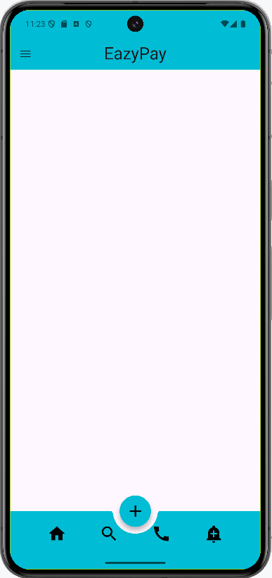
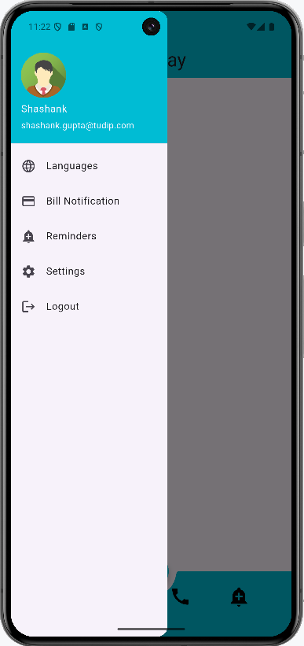

# Bottom Navigation Bar:

- In Flutter, the **Bottom Navigation Bar** is a UI element placed at the bottom of the screen, allowing users to switch between different top-level views or pages in an app.
- It is ideal for apps with 3-5 primary sections.
- The `BottomNavigationBar` widget is used to implement this, where each item represents a distinct section, and a callback function is used to update the selected index when the user taps on an item.

# Drawer:
- The **Drawer** is a slide-out menu typically used for navigation in Flutter apps.
- It provides a hidden menu on the side of the screen that can be revealed by swiping or tapping an icon.
- The `Drawer` widget is used to create this functionality, allowing developers to add a list of options or navigation links that users can select to navigate to different sections of the app.
- It’s commonly used for apps with many sections or options that don’t fit in a bottom navigation bar.

  
  

