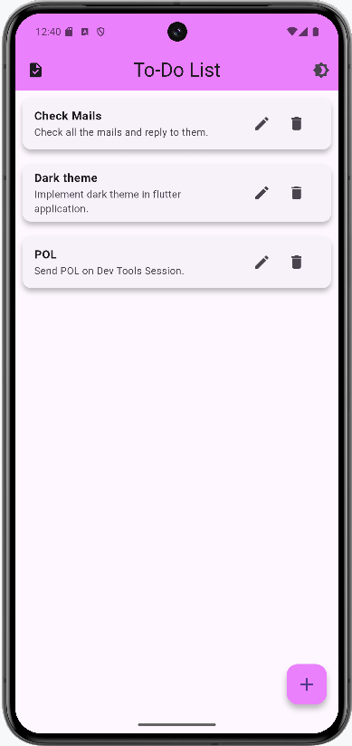

# To-Do App :

- The To-Do Application is a simple, efficient task management tool that allows users to create, edit, delete, and view tasks. 
- It provides a clean, user-friendly interface for organizing daily tasks with optional title and description fields. 
- Tasks are stored locally in an SQLite database using the sqflite package. 
- The application also supports dark and light themes, allowing users to toggle between them for a personalized experience.

## Output:

  

